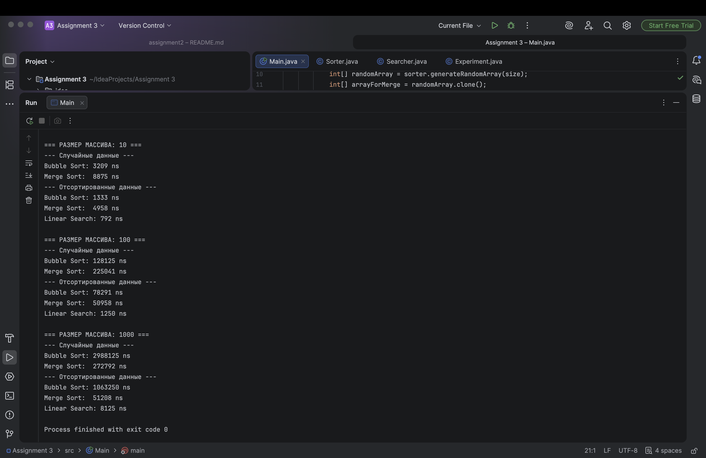

# Sorting and Searching Algorithm Analysis

## Project Overview
This project implements and compares the performance of Bubble Sort, Merge Sort, and Linear Search across different array sizes and data types.

## Algorithm Descriptions
**Bubble Sort (O(n^2)):** A simple comparison-based algorithm that repeatedly swaps adjacent elements. 

**Merge Sort ((n  log n)):** A divide-and-conquer algorithm that splits the array and merges sorted sub-arrays. 

**Linear Search (O(n)):** A simple search that checks each element sequentially. 

## Experimental Results

| Array Size | Data Type | Bubble Sort (ns) | Merge Sort (ns) | Linear Search (ns) |
|------------|-----------|------------------|-----------------|--------------------|
| 10 (Small) | Random    | 3209             | 8875            | 792                |
| 10 (Small) | Sorted    | 1333             | 4958            | 792                |
| 100 (Med)  | Random    | 128125           | 225041          | 1250               |
| 100 (Med)  | Sorted    | 78291            | 50958           | 1250               |
| 1000 (Lrg) | Random    | 2988125          | 272792          | 8125               |
| 1000 (Lrg) | Sorted    | 1063250          | 51208           | 8125               |

## Analysis Questions 
1. **Which sorting algorithm was faster?** On small arrays, Bubble Sort was slightly faster due to low overhead. However, on the Large (1000) array, Merge Sort was about 10 times faster than Bubble Sort.
2. **How does performance change with size?** Bubble Sort's time grows quadratically (O(n^2)), while Merge Sort grows much slower (O(n \log n)), making it superior for large data.
3. **Sorted vs Unsorted:** Sorted data significantly improved Bubble Sort's performance because it performed fewer operations. Merge Sort also became faster but remained consistent in its logic.
4. **Big-O Match:** Yes, the results match theoretical expectations.

## conclusion
I learned that while Bubble Sort is easy to implement, it becomes highly inefficient as data grows. Understanding the difference between theoretical Big-O and practical execution time is crucial for software development.